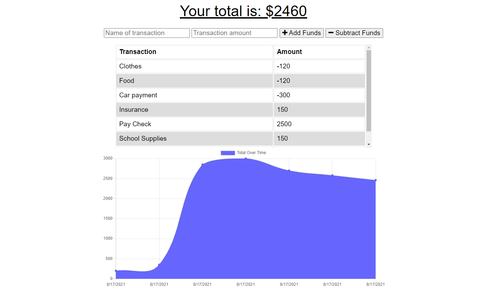

# Online/Offline Budget Tracker:

## Objective:

The Budget Tracker application allows for offline access and functionality.

## Usage: 

The user is able to add expenses and deposits to their budget with or without an internet connection. When entering their transaction while offline, they will be able to populate the total when brought back online. 

## Details:

-Offline Functionality:

 * Can enter deposits
 * Can enter expenses

-When brought back online:

 * The entries entered offline should be added to the tracker. 

 ## Demo:

---
[My GitHub Repository](https://github.com/Maripia12/Online-Offline-Budget-Tracker)

[Deployed Heroku Site](https://evening-badlands-40808.herokuapp.com/)

